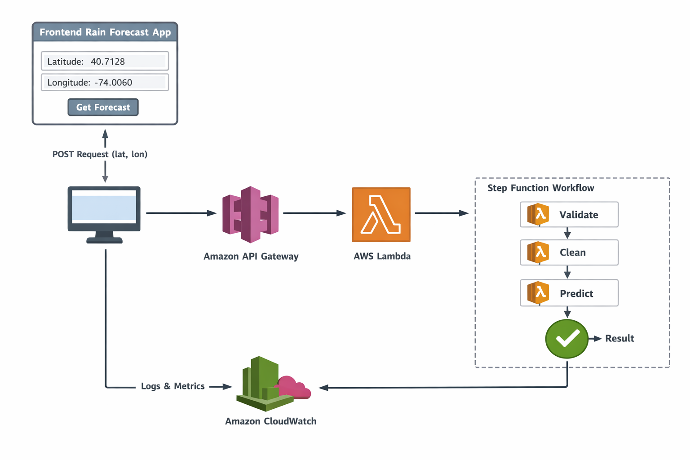

# Rain Prediction — Serverless Data Pipeline

A fully functional serverless, event-driven data pipeline on AWS — built with Step Functions, Lambda, S3, API Gateway, and CloudWatch, deployed as Infrastructure as Code with Terraform.

> ⚠️ This project is functional but **not production-ready**. It is intended for development, learning, and testing purposes.

---

## Pipeline Preview




---

## Project Structure

```
serverless-data-pipeline/
├── src/
│   ├── lambda_validate/
│   │   └── app.py
│   ├── lambda_cleaning/
│   │   └── app.py
│   └── lambda_model/
│       └── app.py
│
└── terraform-deploy/
    ├── infra/
    │   ├── main.tf
    │   ├── s3_frontend.tf
    │   ├── lambda.tf
    │   ├── iam.tf
    │   ├── stepfunctions.tf
    │   ├── step_function_definition.json
    │   ├── cloudwatch_dashboard.tf
    │   ├── api_gateway.tf
    │   ├── outputs.tf
    │   └── variables.tf
    └── README.md
```

---

## Architecture

| Service | File | Role |
|---|---|---|
| S3 | `s3_frontend.tf` | Static frontend hosting |
| Lambda | `lambda.tf` | Data validation, cleaning & ML inference |
| Step Functions | `stepfunctions.tf` + `step_function_definition.json` | Pipeline orchestration |
| API Gateway | `api_gateway.tf` | HTTP endpoint exposure |
| IAM | `iam.tf` | Least-privilege roles & policies |
| CloudWatch | `cloudwatch_dashboard.tf` | Monitoring & alerting |

---

## Technologies

- **AWS Lambda** — Serverless data processing functions
- **AWS Step Functions** — Orchestration of Lambda workflows
- **Amazon S3** — Storage for raw and processed data
- **API Gateway** — REST endpoint for pipeline triggers
- **CloudWatch** — Monitoring dashboard and logs
- **AWS IAM** — Roles and security policies
- **Terraform** — Infrastructure as Code (IaC)

---

## Prerequisites

- Terraform `>= 1.3`
- AWS CLI configured with sufficient permissions

---

## Configuration

Define your values in a `terraform.tfvars` file (never commit this):

```hcl
aws_region    = "eu-west-1"
environment   = "dev"
project_name  = "rain-prediction"
```

See `variables.tf` for the full list of available variables.

---

## Deploy

```bash
cd terraform-deploy/infra

terraform init
terraform plan  -var-file="terraform.tfvars"
terraform apply -var-file="terraform.tfvars"
```

Retrieve outputs (API URL, bucket name, Lambda ARNs) at any time:

```bash
terraform output
```

## Destroy

```bash
terraform destroy -var-file="terraform.tfvars"
```

> ⚠️ This permanently deletes all provisioned resources.

---

## Notes

- The Step Functions definition (`step_function_definition.json`) uses `templatefile()` — ARNs are injected at apply time.
- Remote state (S3 + DynamoDB lock) is recommended for team use — configure in `main.tf`.
- Do not commit `terraform.tfvars`, `.terraform/`, or `*.tfstate` to version control.

---

## License

MIT License — free for educational and professional use.

---

## Author

**Victor A. N.**
